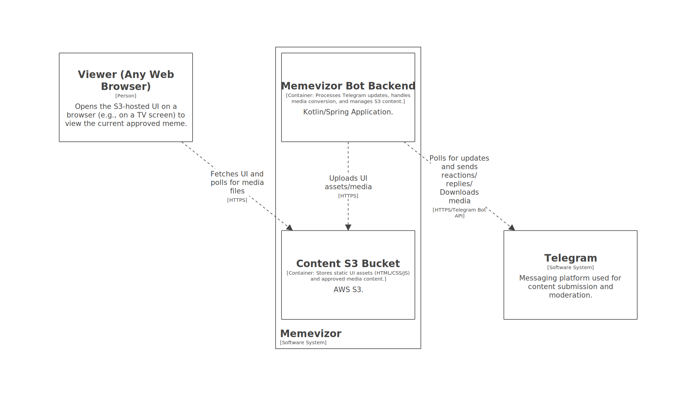

# Memevizor 📺

A Telegram bot for meme management with cloud storage integration and a web interface for display.

## Core Functionality (User Stories)

### Suggesting a Meme (User)

* User scans QR code.
* User sends media (video/picture) to the bot.
* Bot forwards the media to the **Approver Group**.

### Approving a Meme (Approver)

* **Approver** replies to media in the **Approver Group** with an approval command (e.g., `!SOXOK`, `this`).
* **Processing:** If video, bot re-encodes to WebM (AV1 + Opus).
* Bot uploads the final media to **S3**.
* **Client Update:** Frontend detects S3 resource change and downloads the latest media.

### Direct Meme Submission (Approver)

* **Approver** sends media directly to the **Approver Group** or the bot.

## Architecture
The system consists of:
- **Telegram Bot**: Processes commands and media
- **Storage Layer**: S3-compatible storage for memes
- **Web Interface**: Simple HTML page for viewing memes
- **Spring Boot**: Kotlin-based backend with dependency injection



## Setup

The application is configured via Spring Boot properties.

## Deployment

### Docker

1.  Run the container with environment variables:
    ```bash
    docker run -d \
      -e BOT_TOKEN='your_bot_token' \
      -e BOT_FORWARD_CHAT_ID='your_forward_chat_id' \
      -e BOT_APPROVER_USER_IDS='id1,id2,id3' \
      -e S3_ENDPOINT='https.s3.example.com' \
      -e S3_REGION='us-east-1' \
      -e S3_BUCKET='your_bucket_name' \
      -e S3_ACCESS_KEY_ID='your_key' \
      -e S3_SECRET_ACCESS_KEY='your_secret' \
      ghcr.io/pischule/memevizor:latest
    ```

## License
GNU GPLv3
